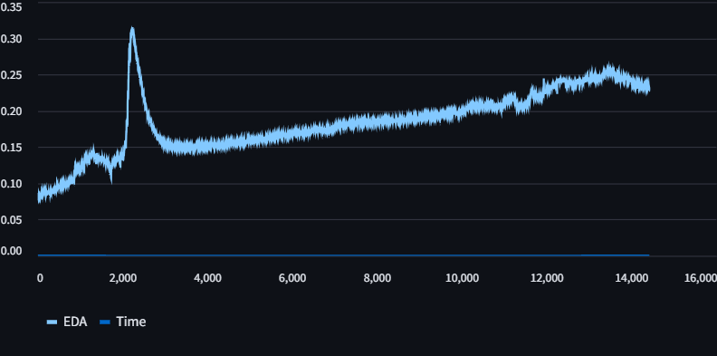

# .avro data visualizer for EmbracePlus from Empatica 📈

Currently there is no tool available that allows users from the EmbracePlus bracelet to visualize their data automatically. For this I developed an online visualizer for .avro format files, where graphs are generated to view participants data sets. 



## Authors

- [@JocelynVelarde](https://github.com/JocelynVelarde)

## Features

- Upload multiple .avro files
- Visualize al raw data metrics in different graphs vs time (taking in consideration sampling time and initial timestamp to ensure continuity and congruency)
- Download .csv datasets generated from the proposed graphs
- Useful when handling large amounts of data
- Light and Dark mode enabled
- Available in all devices

## Structure
```bash
streamlit_app 
├─ home.py
├─ Tests
│  └─ graph.py
│  └─ join.py
│  └─ view.py
├─ assets
├─ pages
│  └─ visualize.py
├─ .gitignore
└─ requirements.txt
```

## Tools

- Streamlit
- pandas
- fastavro
- numpy
- matplotlib

Deployed with: Streamlit Cloud

## Demo

[YouTube](https://www.youtube.com/watch?v=yHeFV8sdVzY)


## License

[MIT](https://choosealicense.com/licenses/mit/)


